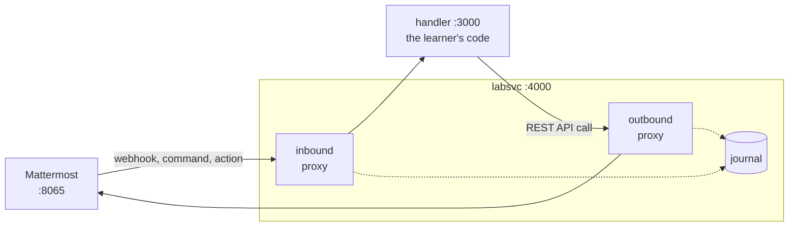

# Mattermost Platform Extensions certification lab

Hands-on labs for the **Platform Extension Expert** certification, hosted on
[Instruqt](https://instruqt.com). Five labs across six challenges, in which a learner
builds a working Mattermost integration one surface at a time against a simulated threat
intelligence feed.

Each module adds a capability the previous one could not provide:

| Challenge | Surface | What the learner builds |
| --- | --- | --- |
| 1 | Incoming webhooks | Alerts arrive in `~alerts` as formatted message attachments |
| 2 | Outgoing webhooks | CRITICAL alerts auto-escalate to `~incidents` |
| 3 | Slash commands | `/threat <indicator>` returns threat intel enrichment |
| 4 | Post actions and dialogs | An Escalate button opens a form and posts an assessment |
| 5 | Plugins, server | A Go hook captures alerts into the KV Store, exposed over HTTP |
| 6 | Plugins, webapp | A custom post card, sidebar pane, AI skills, and a header widget |

Learners are graded by firing a real alert and inspecting what Mattermost actually did
with it, never by reading their source.

## Repository map

| Path | What it is |
| --- | --- |
| [`labsvc/`](labsvc/) | Lab infrastructure: recording proxy, mock services, grader, inspector |
| [`handler/`](handler/) | The learner's integration handler, challenges 1 to 4 |
| [`bin/`](bin/) | Provisioning and helper scripts run on the sandbox host |
| [`track/`](track/) | Instruqt track configuration: hosts, assignments, lifecycle scripts |
| [`variants/`](variants/) | Worked solutions, applied by the platform's solve scripts |
| [`DESIGN.md`](DESIGN.md) | Architecture and the reasoning behind it. Read this first. |

Each of `labsvc/`, `handler/`, and `track/` has its own README covering local use.

## How it fits together

Every request in both directions passes through `labsvc`.



Two properties do most of the work.

**Everything between Mattermost and the learner passes through a recording proxy.** The
Lab Inspector then answers the question that dominates integration support, *"is Mattermost
even calling me"*, at a glance: what was sent, what came back, how long it took. It also
makes otherwise invisible lessons gradeable, such as the slash command timeout.

**Every check supplies its own stimulus.** A check fires its own alert, invokes its own
command, or clicks its own button, then asserts against Mattermost state. Learners never
have to trigger something by hand first, and can re-run a check as often as they like.

`labsvc` and `handler` are deliberately separate processes. The learner's handler breaks
constantly by design, and grading, the mocks, and the inspector have to survive that.

## Getting started locally

Both packages run their TypeScript directly under `tsx`. No build step.

```bash
cd labsvc && npm install && npm run dev     # :4000, then open /inspector
cd handler && npm install && npm run dev    # :3000
```

Use `npm run typecheck`, not `npx tsc`, which installs an unrelated package called `tsc`.

The mocks, proxies, and inspector work standalone. Grading needs a seeded Mattermost and
returns 503 without `MM_ADMIN_TOKEN`. See `.env.example` in each package.

## Working on the track

```bash
cd track
instruqt track validate     # check the configuration
instruqt track push         # deploy config, assignments, lifecycle scripts
instruqt track test         # run the whole track: setup, check, solve, check
instruqt track logs         # tail lifecycle script output
```

**Code and track config deploy separately**, which is easy to trip over: you can push a
track and see none of your code changes.

```bash
git push                          # labsvc, handler, bin, variants  (cloned at setup)
cd track && instruqt track push   # config, assignments, lifecycle scripts
```

Track setup clones this repository to `/opt/lab` on the sandbox. Point a run at a branch
with `LAB_REPO_REF` rather than editing the setup script.

## Status

Working end to end on Instruqt: the sandbox provisions, Mattermost and Postgres come up,
seeding creates the team, channels, users, bots and tokens, the Agents plugin is wired to
the mock LLM, and both services start. Twenty checks are registered across all six
challenges, they correctly fail work that has not been done, and a solution variant exists
for every one.

`instruqt track test` drives the whole track: for each challenge it runs the checks
expecting failure, applies the solution, and runs them again expecting success.

**All six challenges pass, 20 of 20 checks**, end to end on Instruqt.

Outstanding:

- Nothing in Module 6's interface has been looked at in a browser. The grader inspects the
  webapp bundle for the three registrations and says so explicitly, rather than implying it
  proved the components render. Layout, opening the sidebar from the post card, and the
  header count updating all need eyes on them once.
- Setup takes **5m38s** on a clean sandbox, and the learner currently watches all of it
  on the loading screen. About 3m20s of that is warming the Module 6 plugin build caches,
  mostly fetching and compiling the Go dependency tree. Hot start would move it before the
  learner arrives but is not enabled on this track; baking a custom VM image with the
  toolchains, Go module cache and node_modules would remove it outright.
- CI outside Instruqt. `instruqt track test` covers the apply-and-check loop today, but it
  needs a live sandbox, so it is not something a pull request can run.

## Notes on the curriculum

The lab exercises a few things the source curriculum gets wrong, and the design works
around them rather than teaching them:

- **Posts created by an incoming webhook do not fire outgoing webhook triggers.** The mock
  feed therefore posts through the learner's webhook for challenge 1, where configuring one
  is the lesson, and over REST as a bot from challenge 2 onward. Challenge 2 is
  unsatisfiable otherwise.
- **Threads cannot span channels.** Cross-channel escalations carry a permalink, never a
  `root_id`.
- **There is no HMAC signature on any Mattermost integration surface.** Outgoing webhooks
  and slash commands carry a plaintext shared token in the request body, so constant time
  token comparison is the lesson, not signature verification.
